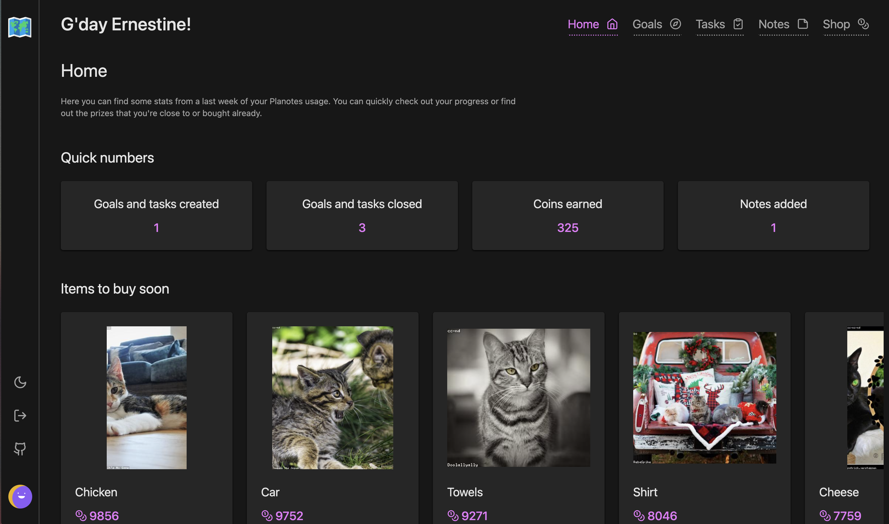

# Planotes

Planotes is a full-blown application for planning and managing everyday life. The key feature is the gamification of the whole process. Collect points and exchange them for prizes that you set up for yourself.
Keep track of your progress and try to achieve your with small steps at a time. Take notes that you can transform into action items or search through them.

## Live version

You can check it out [here](https://planotes.xyz/).

## Run it locally

- Clone repo
- Make sure `pnpm` is installed
- Use `docker` to run essential services
- Run `pnpm i`
- Use `pnpm migrate` to populate your databse
- Run `pnpm dev`

## Stuff used

- SolidJS + Solid Start
- UnoCSS (Tailwind preset)
- Primsa
- TypeScript
- Zag
- Zod

## Feedback

Any feedback is appreciated. Feel free to head me up.

## License

[MIT](https://choosealicense.com/licenses/mit/)
